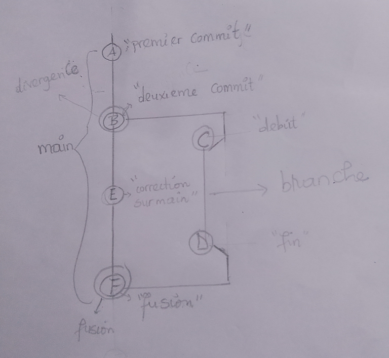

# Démo 1 : Le graphe au tableau

## 1. Mon dessin (fait à la main avant de lancer `git log`)



Lien direct vers la photo : [graphe_tableau.jpg](graphe_tableau.jpg)

**Ce que j'ai dessiné :**
- **Commits** : A « premier commit », B « deuxieme commit », C « debut », D « fin », E « correction sur main », F « fusion ».
- **Ligne `main`** : A, B, E, F, dessinée verticalement à gauche, du plus ancien (en haut) au plus récent (en bas).
- **Branche `branche`** : C, D, dessinée à droite.
- **Point de divergence** : B. La branche part de B, puis `main` continue avec E.
- **Point de fusion** : F. Il reçoit deux traits, un venant de E (`main`) et un venant de D (`branche`).

## 2. La sortie réelle de Git

Commande : `git log --oneline --graph`

```
*   1cdcf89 (HEAD -> main) fusion
|\
| * fd65657 (branche) fin
| * 8dfc0f6 debut
* | d013fd0 correction sur main
|/
* ce0c3d4 deuxieme commit
* 325d4fc premier commit
```

## 3. Correspondance commit par commit

| Mon dessin | Hash Git | Message | Correspond ? |
|---|---|---|---|
| A | `325d4fc` | premier commit | Oui, c'est le premier commit, tout en bas |
| B | `ce0c3d4` | deuxieme commit | Oui, c'est le point de divergence (le `\|/` juste au-dessus) |
| C | `8dfc0f6` | debut | Oui, premier commit de `branche` |
| D | `fd65657` | fin | Oui, dernier commit de `branche` (`branche` pointe dessus) |
| E | `d013fd0` | correction sur main | Oui, commit de `main` fait pendant que `branche` avançait |
| F | `1cdcf89` | fusion | Oui, c'est `HEAD -> main`, avec le `\|\` qui montre ses deux parents |

Les six commits de mon dessin existent dans la sortie de Git, avec la même structure : une divergence en B et une fusion en F.

## 4. Les écarts entre mon dessin et Git

- **Écart 1 : le sens.** Mon dessin va du plus ancien (A, en haut) au plus récent (F, en bas). Git affiche l'inverse : le commit le plus récent (`fusion`) est en haut et le premier commit est en bas.
  **Pourquoi :** `git log` liste les commits du plus récent au plus ancien, en partant de `HEAD` et en remontant les parents.

- **Écart 2 : l'ordre de E, C et D.** Sur mon dessin, E se trouve entre C et D, comme dans l'ordre où j'ai fait les commits (C, D, puis E). Dans Git, `fin` et `debut` sont affichés avant `correction sur main`.
  **Pourquoi :** avec `--graph`, Git ne suit pas la chronologie stricte. Il groupe les commits de chaque ligne d'historique pour ne pas mélanger `main` et `branche`, et affiche d'abord la branche (deuxième parent de la fusion).

- **Écart 3 : les symboles.** J'ai dessiné des ronds, des lettres et des traits. Git utilise `*` pour un commit, `|` pour une ligne qui continue, `\` pour la séparation à la fusion et `/` pour le rejoignement à la divergence.
  **Pourquoi :** Git dessine en texte dans le terminal, donc avec des caractères.

- **Écart 4 : l'identité des commits.** Mes commits sont désignés par des lettres (A à F). Git les identifie par un hash de 7 caractères (`325d4fc`, etc.).
  **Pourquoi :** les lettres n'existent que sur mon dessin. Pour Git, l'identité d'un commit est son hash.

- **Écart 5 : les noms de branches.** J'ai écrit `main` sur toute la ligne de gauche. Git n'écrit `(HEAD -> main)` et `(branche)` qu'à l'extrémité de chaque ligne, sur le dernier commit.
  **Pourquoi :** une branche n'est qu'une étiquette qui pointe vers un seul commit, le plus récent. Le dessin, lui, colorie toute la ligne. Git ajoute aussi `HEAD`, que je n'avais pas dessiné : il indique où je me trouve actuellement.

## 5. Ce que j'ai retenu

- La divergence apparaît quand deux commits ont le même parent (ici `deuxieme commit` a deux enfants : `debut` et `correction sur main`).
- La fusion est un commit à **deux parents** (ici `fusion` a pour parents `correction sur main` et `fin`). C'est ce que montre le `|\` sous `fusion`.
- Sans le `--no-ff` et sans le commit E sur `main`, Git aurait fait une avance rapide (*fast-forward*) : il n'y aurait ni divergence ni commit de fusion.
-
# Preuve
```bash
C:\Users\Administrator> mkdir demo1

C:\Users\Administrator> cd demo1

C:\Users\Administrator\demo1> git init -b main
Initialized empty Git repository in C:/Users/Administrator/demo1/.git/

C:\Users\Administrator\demo1> echo a > a.txt

C:\Users\Administrator\demo1> git add .

C:\Users\Administrator\demo1> git commit -m "premier commit"
[main (root-commit) 325d4fc] premier commit
 1 file changed, 1 insertion(+)
 create mode 100644 a.txt

C:\Users\Administrator\demo1> echo b > a.txt

C:\Users\Administrator\demo1> git commit -am "deuxieme commit"
[main ce0c3d4] deuxieme commit
 1 file changed, 1 insertion(+), 1 deletion(-)

C:\Users\Administrator\demo1> git switch -c branche
Switched to a new branch 'branche'

C:\Users\Administrator\demo1> echo c > c.txt

C:\Users\Administrator\demo1> git add .

C:\Users\Administrator\demo1> git commit -m "debut"
[branche 8dfc0f6] debut
 1 file changed, 1 insertion(+)
 create mode 100644 c.txt

C:\Users\Administrator\demo1> echo d > c.txt

C:\Users\Administrator\demo1> git add .

C:\Users\Administrator\demo1> git commit -am "fin"
[branche fd65657] fin
 1 file changed, 1 insertion(+), 1 deletion(-)

C:\Users\Administrator\demo1> git switch main
Switched to branch 'main'

C:\Users\Administrator\demo1> echo e > e.txt

C:\Users\Administrator\demo1> git add .

C:\Users\Administrator\demo1> git commit -m "correction sur main"
[main d013fd0] correction sur main
 1 file changed, 1 insertion(+)
 create mode 100644 e.txt

C:\Users\Administrator\demo1> git merge --no-ff branche -m "fusion"
Merge made by the 'ort' strategy.
 c.txt | 1 +
 1 file changed, 1 insertion(+)
 create mode 100644 c.txt

C:\Users\Administrator\demo1> git log --oneline --graph
*   1cdcf89 (HEAD -> main) fusion
|\
| * fd65657 (branche) fin
| * 8dfc0f6 debut
* | d013fd0 correction sur main
|/
* ce0c3d4 deuxieme commit
* 325d4fc premier commit
```